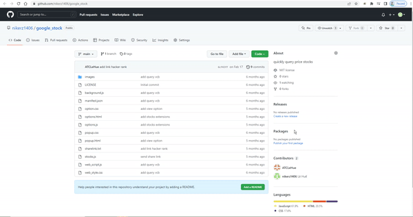

# VN Stock Price Query Extension

A Chrome extension to quickly query and display real-time prices for Vietnamese stocks. This tool provides a simple popup interface and options page to manage your favorite stocks, using the public API at [https://api.mrlehue.com/api/stocks/](https://api.mrlehue.com/api/stocks/).

## Features
- 🔍 Quickly search and view VN stock prices from your browser popup
- 📈 Supports multiple stock servers (HOSE, HNX, UPCOM)
- ⚙️ Manage your stock list via the options page
- 💾 Uses Chrome storage to save your preferences
- 🎨 Clean, responsive UI with Bootstrap

## Demo

## Installation
1. Clone or download this repository.
2. Open Chrome and go to `chrome://extensions/`.
3. Enable **Developer mode** (top right).
4. Click **Load unpacked** and select this project folder.
5. The extension icon will appear in your browser toolbar.

## Usage
- Click the extension icon to open the popup and view your tracked stocks.
- Use the **Options** page to add, remove, or reorder stocks and select the data server.
- Stock prices are fetched from the API endpoint below.

## API Endpoint
- All stock data is retrieved from:  
  `https://api.mrlehue.com/api/stocks/`
- Example usage:  
  `https://api.mrlehue.com/api/stocks/<STOCK_CODE>/<SERVER>`
  - `<STOCK_CODE>`: e.g. `VIC`, `VNM`, etc.
  - `<SERVER>`: 1 (HOSE), 2 (HNX), 3 (UPCOM)

## Project Structure
- `manifest.json` – Chrome extension manifest
- `popup.html`, `js/popup.js` – Popup UI and logic
- `options.html`, `js/options.js` – Options page UI and logic
- `js/stocks.js` – Stock data fetching and rendering
- `config/api.js` – API endpoint configuration
- `css/` – Stylesheets
- `images/` – Icons
- `videos/` – Demo media

## License
MIT License. See [LICENSE](LICENSE) for details.
